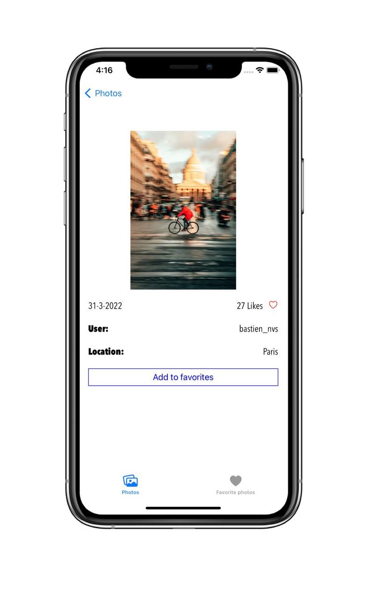
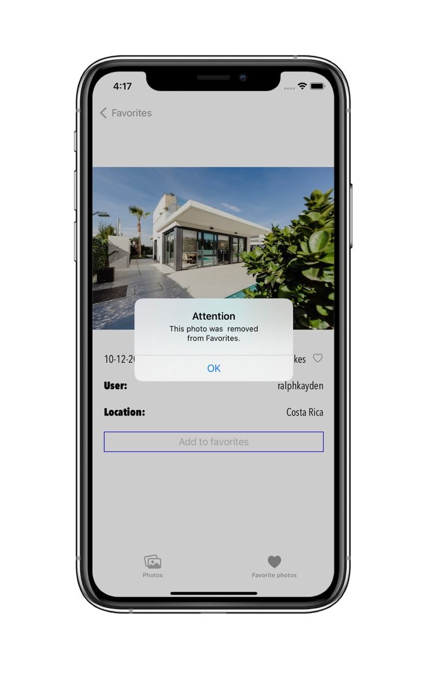

# unsplash_photo
Test project, tha main task is to load photos from Unsplash.
You can:
* See random photos
* Search for photos by a word
* Open photo card with some details
* Add/Delete photos to Favorites

## Stack
* UIKit
* Alamofire
* JSON
* Realm
* Kingfisher

## Screenshots
")
")

")
")
